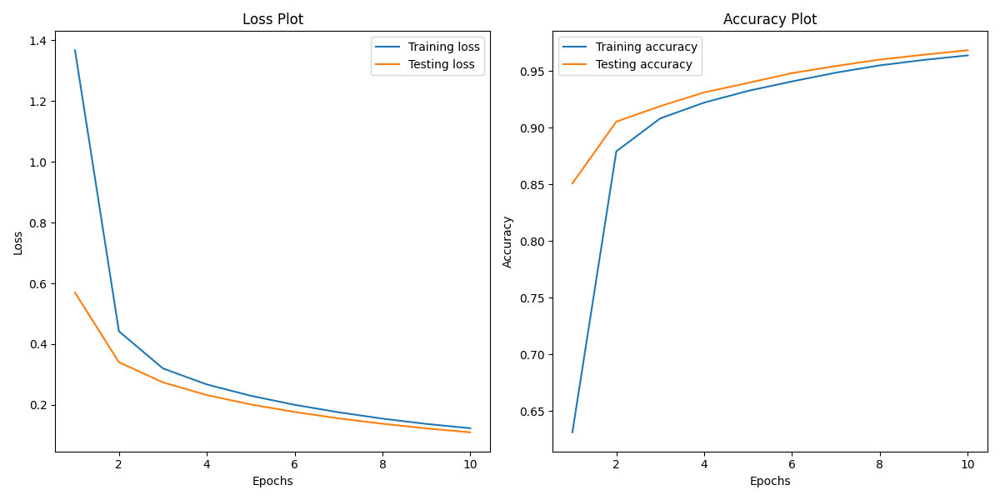

# LeNet5-Implementation

## Architecture


Paper: http://vision.stanford.edu/cs598_spring07/papers/Lecun98.pdf.

I have implemented the OG network ([model.py](./model/model.py)) as shown in figure above with slight change in output activation function as Softmax rather than Euclidean Radial Basis Function.

Also, I have written a more modern version of LeNet-5 here: [modern.py](./model/modern.py).

## Usage

- For OG LeNet5

```bash
python train.py --epochs 10
```

- For Modern LeNet5

```bash
python train.py --epochs 10 --model_name LeNet5Modern 
```

## Plots

- After 10 epochs of training, the models showed following results:

    - OG LeNet5

    

    - Modern LeNet5

    